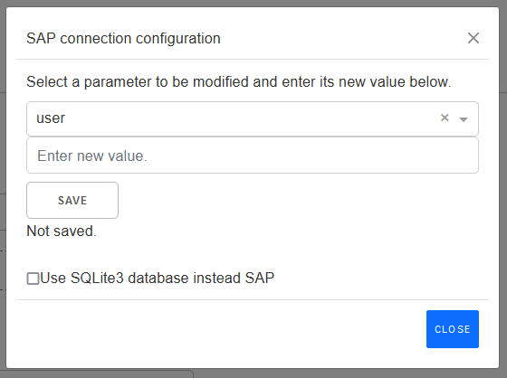
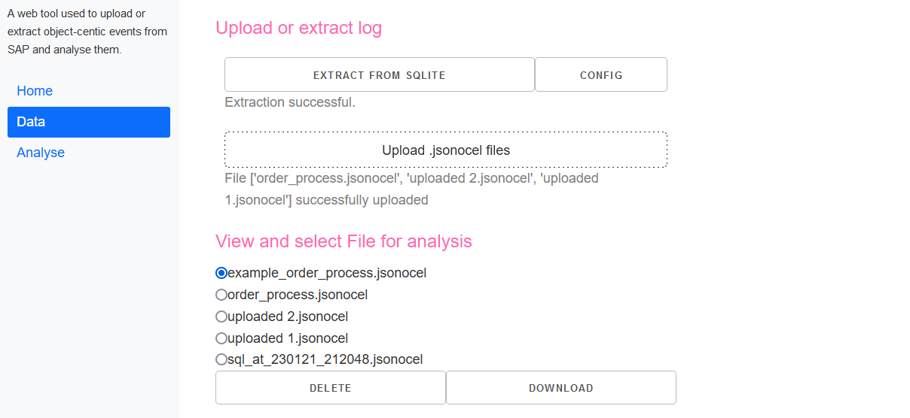

# OC-Process-Discovery
A process discovery tool working on object-centric event logs extracted from SAP ERP. It was developed in the "Process Discovery Using Python" lab at RWTH. 

# Table of Contents
- [OC-Process-Discovery](#oc-process-discovery)
- [Table of Contents](#table-of-contents)
- [Setup](#setup)
  - [Python setup](#python-setup)
  - [Docker setup](#docker-setup)
- [Usage](#usage)
  - [Overview (Jean)](#overview-jean)
  - [OCEL Extraction](#ocel-extraction)
    - [Extraction from SAP Cloud](#extraction-from-sap-cloud)
    - [Extraction from SQLite](#extraction-from-sqlite)
    - [Change prefilter: date range](#change-prefilter-date-range)
  - [Dataset management](#dataset-management)
  - [Filtering datasets (Kacper)](#filtering-datasets-kacper)
  - [Analysis (Jean)](#analysis-jean)
  - [Troubleshooting](#troubleshooting)
- [Further information](#further-information)

# Setup
## Python setup
This project runs on Python 3.9.13

1. Create virtual environment. For example, with `python -m venv venv`.
2. Activate virtual environment. For example, with `source venv/bin/activate` or `venv\Scripts\activate.ps1`.
3. Install dependencies with `pip install -r requirements.txt --use-deprecated=legacy-resolver `.
4. add /environment/.env file with content from .env.development.
5. Run project / index.py
   1. in VS Code: use the configuration stored in launch.json file
   2. in PyCharm: use the configuration stored in .idea/runConfigurations/oc_process_discovery.xml file

## Docker setup

1. Check if pyrfc is commented out in requiremnts.txt
2. Build docker image: `docker build -t ocpaapp`
3. Run image: `docker run --name ocpa -p 8084:8085 ocpaapp`

Note: Because SAPnwRFC is Platform-dependent and can't be shared in this repository due to licensing reasons, it is not included in the docker image. Therefore, extraction directly from SAP systems is yet not possible if you use Docker.

# Usage
## Overview (Jean)

## OCEL Extraction
You can use this tool to extract an OCEL containing O2C related events from SAP S/4HANA. Alternative from that, you can extract from a SQLite database containing the required SAP tables.

Our tool queries the tables *VBFA*, *VBAK* as well as *BSAD*, *CDHDR* and *CDPOS*. From these tables, information about SAP-table-documents that are related to the Order-To-Cash process (e.g., Inquiry, Order, …) are extracted and used to generate an OCEL. 

In the app, all configurable parameters and settings related to the extraction are placed in a configuration popup:

### Extraction from SAP Cloud
To use this feature, you have to set the connection parameters and credentials for your SAP instance. You can either set these in the `.env` file before start, or change these in the Configuration Popup:

1. In data-view, click on `CONFIG`
2. In the popup: Select the parameter you want to change in the dropdown (3) type the new value (4) and click save (5).
3. Make sure your device is allowed to connect with SAP. After everything is set, close the Popup and start Extraction.

### Extraction from SQLite
A SQLite with sample data is included in this repository. To use your data, you have to provide an own SQLite database.

An example script for creating a SQLite Database the tool can process is given here: [utils/save_tables.py](https://github.com/marcoheinisch/oc-process-discovery/blob/feature/manual/utils/save_tables_sqlite.py). 

Replace the `sap_tables.sqlite` or, if you use Docker, mount a SQLite volume as described in the section Setup. Subsequently, follow these steps:

1. In data-view, click on `CONFIG`
2. Select `Use SQLite 3 database instead SAP` (6)
3. Close the Popup and start Extraction.

### Change prefilter: date range
Currently, we only prefilter event information by a date range, which is configurable in the Configuration Popup:

1. In data-view, click on `CONFIG`
2. In the popup: Type the new values in the date fields (4) and click save (5).

## Dataset management
In the data management page, you are given the possibility to either extract logs as described, download or to upload them from your local file system:

If, instead of uploading logs from the SAP, you want to upload them from your local file system, simply click on the button `Upload .jsonocel files`. Your local file system should then pop up, enabling you to upload any desired file. Please note, however, that only *.jsonocel* files are accepted.

All your extracted and/or uploaded files should be visible in the section "View and select file for analysis". There, you will have not only the possibility of selecting specific files to be deleted, but also to be downloaded. All files will then be ready to be filtered, as we will see now thoroughly in the next section.

## Filtering datasets (Kacper)

## Analysis (Jean)

## Troubleshooting
- The error "No events to process." is shown when no events are found in the log. This can happen when the prefilter is set to a date range that does not contain any events. To fix this, change the prefilter in the configuration popup.
- If you get an error like "No module named 'sapnwrfc'", you have to install the SAP NetWeaver RFC SDK to extract directly from SAP. 

# Further information
Tools:
- [pm4py](https://pm4py.fit.fraunhofer.de/)
- [plotly dash](https://dash.plotly.com/devtools)

About OCEL:
- [www.ocel-standard.org](https://www.ocel-standard.org/)
- [OCEL: A Standard for Object-Centric Event Logs](https://www.researchgate.net/publication/353809980_OCEL_A_Standard_for_Object-Centric_Event_Logs) (paper)