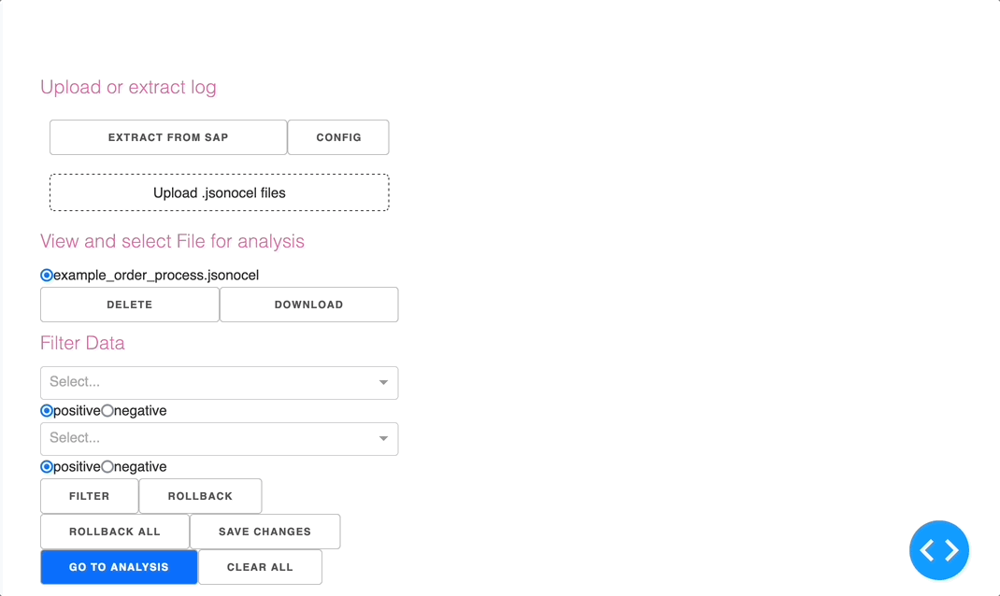

# oc-process-discovery
A process discovery tool working on object-centric event logs extracted from SAP ERP. It was developed in the "Process Discovery Using Python" lab at RWTH. 


# Setup
## Manual setup: Python venv
This project uses Python 3.9.13

1. Create virtual environment. For example with `python -m venv venv`
2. Activate virtual environment. For example with `source venv/bin/activate` or `venv\Scripts\activate.ps1` 
3. Install dependencies with `pip install -r requirements.txt --use-deprecated=legacy-resolver `
4. add /environment/.env file with content from .env.development
5. Run project / index.py
   1. in vs code: use the configuration stored in launch.json file
   2. in pycharm: use the configuration stored in .idea/runConfigurations/oc_process_discovery.xml file

## Docker setup
Note: Because SAPnwRFC is Plattform depencent and can't be shared in this repository due to lizensing, Extraction directly from SAP systems is yet not possible in Docker.
1. Check if pyrfc is commented out in requiremnts.txt
2. execute `docker build -t ocpaapp .`
3. run image

## Usage
### Overview (Jean)
### Extraction from SAP (Marco)
### Dataset management (upload, download, delete) (Pedro)

In the data management page, you are given the possibility to either extract logs from the SAP or to upload them from your local file system. 

To do this the first way, simply click on the button "EXTRACT FROM SAP". A message should then appear on your screen, below the extraction button, telling you if the extraction was successful or not. Beside this button, you may notice that there is also another one, where "CONFIG" is written. Its main function is to allow you to configure all SAP connection parameters, which are: user,
passwd, ashost, saprouter, msserv, sysid, group, client, lang and trace. If you want you update one of those parameters, simply click on this button. A modal will then appear, where a drop-down menu with all the parameters is given. Choose the parameter you want to update, enter its new value, and then save your changes. A message should also appear under the "SAVE" button, telling you which parameter has been successfully updated.

If, instead of uploading logs from the SAP, you want to upload them from your own local file system, simply click on the button "Upload .jsonocel files". Your local file system should then pop up, enabling you to upload any desired file. Please note, however, that only .jsonocel files are accepted.

All your extracted and/or uploaded files should be visible in the section "View and select file for analysis". There, you will have not only the possibility of selecting specific files to be deleted, but also to be downloaded. All files will then be ready to be filtered, as we will see now thoroughly in the next section.

### Filtering datasets (Kacper)
On the same [data management page](dms) you can find a Filtering segment that presents you with an opportunity to refine your data based on the preliminary analysis results. That way, you can observe how your process models change in relation to minor modifications in the underlying data and draw conclusions accordingly. Our UI offers some tools and options that will make your work more productive and comprehensive:
#### Filter on Event Attributes
1. Choose the event attribute that you want to filter by, say "ocel:activity"
2. Pick a list of values for that attribute from the dropdown that appeared after that.
3. Positive/Negative - here you have to decide whether you want to leave the values chosen in the data (Positive) or their complement (Negative)

This is how that would be implemented in the backend:
```
filtered_ocel = pm4py.filter_ocel_event_attribute(ocel, "ocel:activity", ["Item out of stock", "Fuel Car", "Reorder Item"], positive=False)
```
... and here's how you can achieve the same result with minimal effort using our UI:


### Analysis (Jean)

## Troubleshooting

## Further information
Links to the documentation of the used libraries and frameworks.


