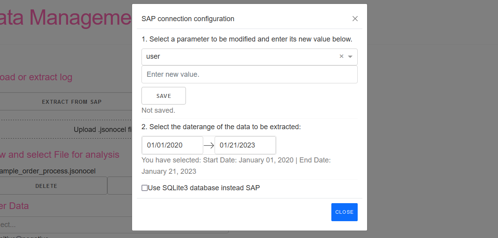
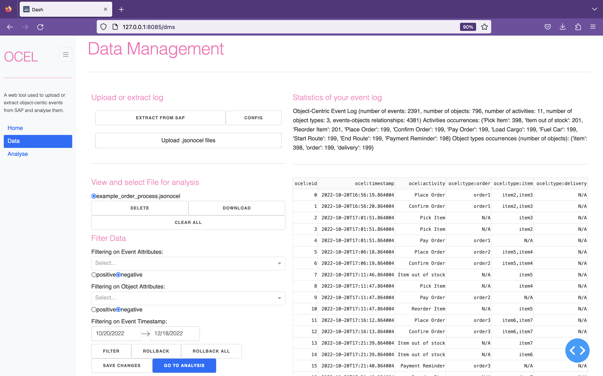

# OC-Process-Discovery
A process discovery tool working on object-centric event logs extracted from SAP ERP. It was developed in the "Process Discovery Using Python" lab at RWTH. 
## Setup
### Manual setup: Python venv
This project runs on Python 3.9.13
1. Create virtual environment. For example with `python -m venv venv`
2. Activate virtual environment. For example with `source venv/bin/activate` or `venv\Scripts\activate.ps1` 
3. Install dependencies with `pip install -r requirements.txt --use-deprecated=legacy-resolver `
4. add /environment/.env file with content from .env.development
5. Run project / index.py
   1. in vs code: use the configuration stored in launch.json file
   2. in pycharm: use the configuration stored in .idea/runConfigurations/oc_process_discovery.xml file
### Docker setup
Note: Because SAPnwRFC is Plattform depencent and can't be shared in this repository due to lizensing, Extraction directly from SAP systems is yet not possible in Docker.
1. Check if pyrfc is commented out in requiremnts.txt
2. Build docker image: `docker build -t ocpaapp .`
3. Run image: `docker run --name ocpa -p 8084:8085 ocpaapp   `
## Usage
### Overview (Jean)
### Extraction from SAP (Marco)
You can use this tool to extract a OCEL containing O2C related events from SAP 4/hana or alternative from a sqlite database cotaining needed SAP tables. 
#### Extraction from SAP Cloud
To use this feature you have to set the connection parameters and credentials for you SAP instancence:
1. In data-view click on Configuration (2) 


2. In the popup: Select the parameter you want to change in the dropdown (3) type the new value (4) and click save (5).   



3. Make sure your device is allowed to connect with SAP. After everything is set, close the Popup und start Extraction (5). 

#### Extraction from SQLite
You don't have to set SAP credentials. Instead go to Configuration Popup and select "Use SQLite 3 database instead SAP" (6)


### Dataset management (upload, download, delete) (Pedro)


In the data management page, you are given the possibility to either extract logs from the SAP or to upload them from your local file system. 

To do this the first way, simply click on the button "EXTRACT FROM SAP". A message should then appear on your screen, below the extraction button, telling you if the extraction was successful or not. Beside this button, you may notice that there is also another one, where "CONFIG" is written. Its main function is to allow you to configure all SAP connection parameters, which are: user,
passwd, ashost, saprouter, msserv, sysid, group, client, lang and trace. If you want you update one of those parameters, simply click on this button. A modal will then appear, where a drop-down menu with all the parameters is given. Choose the parameter you want to update, enter its new value, and then save your changes. A message should also appear under the "SAVE" button, telling you which parameter has been successfully updated.

If, instead of uploading logs from the SAP, you want to upload them from your own local file system, simply click on the button "Upload .jsonocel files". Your local file system should then pop up, enabling you to upload any desired file. Please note, however, that only .jsonocel files are accepted.

All your extracted and/or uploaded files should be visible in the section "View and select file for analysis". There, you will have not only the possibility of selecting specific files to be deleted, but also to be downloaded. All files will then be ready to be filtered, as we will see now thoroughly in the next section.

### Filtering datasets (Kacper)
On the same [data management page](dms) you can find a Filtering segment that presents you with an opportunity to refine your data based on the preliminary analysis results. That way, you can observe how your process models change in relation to minor modifications in the underlying data and draw conclusions accordingly. Our UI offers some tools and options that will make your work more productive and comprehensive:
#### Filter on Event Attributes
1. Choose the event attribute that you want to filter by, e.g. *ocel:activity*
2. Pick a *list of values* for that attribute from the dropdown that appears after that.
3. *Positive/Negative* - here you have to decide whether you want to leave the values chosen in the data (Positive) or their complement (Negative). Negative is chosen as default.

Example from the backend:
```
filtered_ocel = pm4py.filter_ocel_event_attribute(ocel, "ocel:activity", ["Item out of stock", "Fuel Car", "Reorder Item"], positive=False)
```

#### Filter on Object Attributes
Similarly to Filter on Event Attributes, for the next type of filtering you need to:

1. Choose the object attribute that you want to filter by, e.g. *ocel:type*
2. Pick a *list of values* for that attribute from the dropdown that appears after that.
3. Set the *Positive/Negative* flag (Negative as default)

Example from the backend:
```
filtered_ocel = pm4py.filter_ocel_object_attribute(ocel, "ocel:type", ["order", "delivery"], positive=True)
```

#### Filter on Event Timestamp
By picking a *start date* and an *end date* you can restrict your event log to the chosen time interval. This can prove a useful functionality when confronted with a process that may fluctuate over time, e.g. as a result of a varying strain on the process, introduction of new events, change in procedures, etc. The user should not worry about picking an invalid time interval - the boundaries are already set based on the log in consideration.

Example from the backend:
```
filtered_ocel = pm4py.filter_ocel_events_timestamp(ocel, "1981-01-01 00:00:00", "1982-01-01 00:00:00", timestamp_key="ocel:timestamp")
```

#### All three filters combined: an example
Example of a successful filtering: in the first picture you can see the chosen filtering options and the log before the filters have been applied. Our setting are:

1. Leave all ***Reorder item*** events out.
2. Filter all objects of type ***delivery*** out.
3. Consider only the month of ***November***.

Below, in the second picture, is the result log.


#### Buttons
To understand how the buttons work, one first needs to account for the mechanics behind filtering in this application and how it is interconnected with the data management system.
- First of all, filtering is carried out discretely (in steps) by pressing the **Filter** button. Every step may consist of one or more filtering options being used: this is done to make your work more efficient. If it makes sense to keep a couple of different filtering substeps part of the same logical step, you are more then welcome to apply more then one filter at the same time. 
- If you follow this path, it will be easier to go back in time using the **Rollback** button. Rollback reverts to the state of the data before the last filtering step was applied (so, basically, before you pressed the Filter button). 
- Sometimes, you may want to decide to abandon your changes to the data completely even after going through multiple filtering steps. This can be done using the **Rollback all** button. It gives you the guarantee of going back to the original state of the selected file.
- Together with the next button, **Save all**, the rollbacks enable you to version-control your datasets. After a given number of filtering steps, you can save your changes into a new file (with a name having a "_filtered" suffix). The original branch is then reset to the state before filtering. This functionality can also be used to copy files (after zero steps). Subsequently, the newly created file is automatically selected and so any next step will be applied to the old and not to the new file. 
  * Be careful: all intermediate states are deleted after saving changes to a new file. This means that rollback does not work on the new file anymore (or on the old one, since its state is reset too).
  * Don't worry about the filename resolution too much. If a filename is already in use, we will definitely find a free one!
  * You DO NOT have to save changes if you want to download the event log in its current form.
- Finally, **Clear all** is the Big Reset option that will come in handy once you want to move to a new task or start again from scratch. It will delete all files together with their intermediate states and replace them with a singular example event-log. It can thus be understood as a cache-cleaning tool and is also invoked on start-up of the application, preventing memory leaks and making sure it will not get cluttered after longer use. The user should consider either rebooting or pressing that button from time to time (given that they can export their more well-baked event logs and import them in a new instance anyway) instead of running the same instance indefinitely.

There are also two navigation buttons on the data and analysis pages: **Go to analysis** and **Go to dms**. To press any of them is equivalent to choosing the respective page from the sidebar to the left. They serve the sole purpose of cutting down distance from one click to the next.

Below the buttons there is a minimalistic message board that will keep the status of your last action. For example, after pressing the **Rollback all** button:


#### Statistics and log preview
To the right of the data management and filtering segments you can see some statistics of your event log followed by its real-time preview. The neat part: the preview is always up to date with the most recent state of the selected log. As a result, you will be able to observe the changes live, compare different logs and, in general, make more well-informed decisions regarding your next steps.

### Analysis (Jean)

## Troubleshooting & FAQ
* One of the algorithms, pm4py, runs into a KeyError if the user filters out all event attributes except for one. This seems to have to do with the internal implementation of pm4py which doesn't consider border cases after filtering has been applied/doesn't update its knowledge base. In this case, please use one of the two remaining algorithms.
* Pm4py also presupposes that default values be defined for ocel:global-event and ocel:global-object in your log. Therefore, you may get a respective KeyError if you upload the log yourself and do not use the extraction function. You can use one of the other algorithms or add the following lines to your log file to remedy this:
    ```
      "ocel:global-event": "default",
      "ocel:global-object": "default",
    ```
* If you press **Download** without pressing **Save all** first, you will download the most recent state (after filtering) of the event log to be sure but bear in mind that the old file will still preserve changes done to it. That means: if you upload that file again, the two event logs will be the same. Although that is the desired behavior, it differs from when you would just save the changes: then, the old file would be reset and the new one would preserve the changes.

## Further information
Links to the documentation of the used libraries and frameworks.


